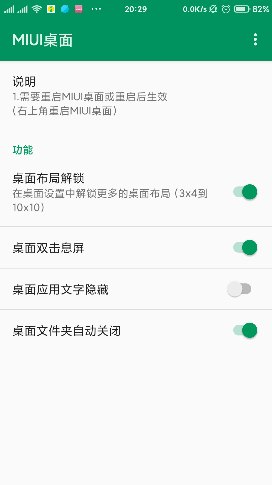
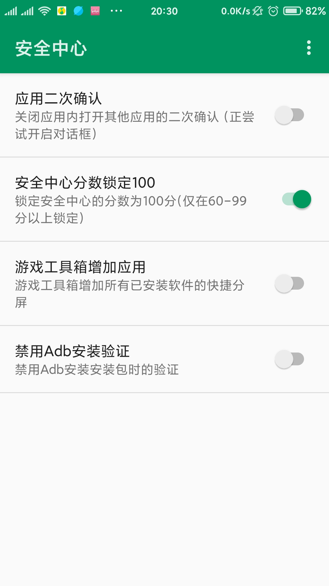
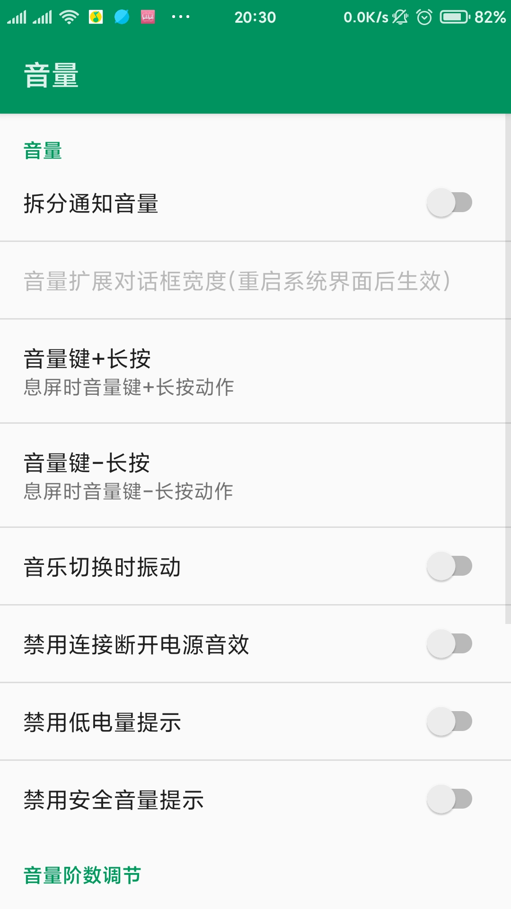
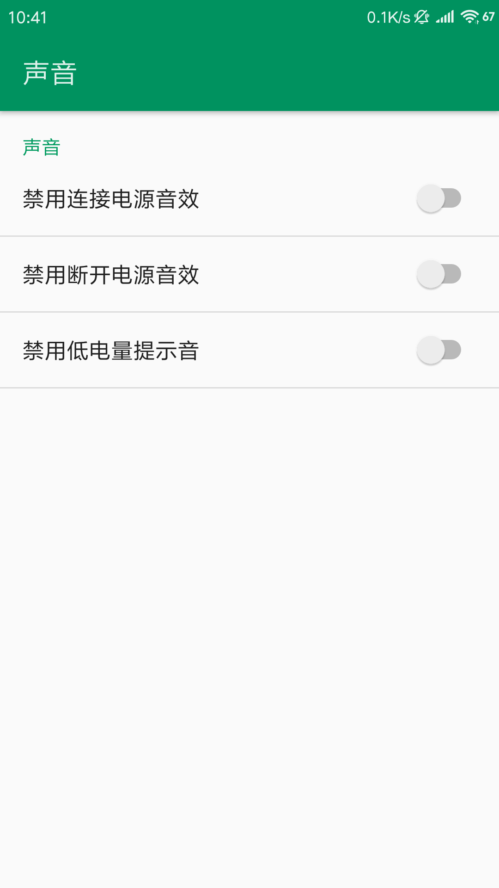
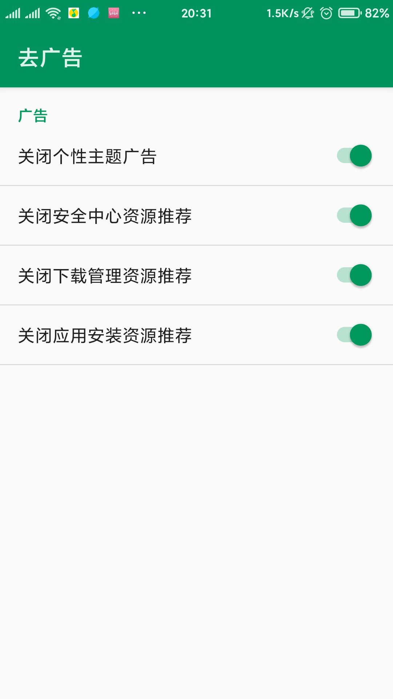

# ChiMi

[English](https://github.com/yonghen/chimi-/blob/master/README_EN.md)  丨 简体中文</b>

## 模块说明 

MIUI增强扩展模块 (LSPosed/Xposed）
最新版 V5版本只适用于MIUI13

## 模块功能

系统界面增强(点击查看详情)

  - 状态栏隐藏图标与视图 (隐藏飞行模式、信号、静音、震动、电量、VPN...的图标)
  - 状态栏布局 (时钟居右，时钟居中)
  - 状态栏显示天气、温度、电流。
  - 状态栏时钟自定义 (显示年月日、星期、时辰、秒)
  - 状态栏双排网速
  - MIX Alpha 充电动画
  - 锁屏显示步数
  - 锁屏显示闹钟
  
  ...

Android系统增强(点击查看详情)

  - 拆分通知音量
  - 息屏音量键长按动作自定义
  - 移除不受信任触摸限制
  
  ...

手机管家增强(点击查看详情)

  - 移除打开应用二次确认
  - 跳过警告时间
  - 分数锁定
  
  ...

查看更新日志和下载使用发现更多功能

## 使用方法
- 在Xposed管理器(LSPosed)中激活模块
- 作用域勾选推荐应用
- 重启目标应用或者重启手机
- 功能突然失效的请清除ChiMi数据，并重新启动目标应用程序或重新启动手机

## 无法使用
- 停用可能起冲突的Xposed模块和Magisk模块.
- 重新添加应用和重新勾选模块.
- 清除ChiMi数据，或者重装ChiMi.
- MIUI版本不适配.

## 已知bug：
- 锁屏时间样式选择第四个，添加闹钟失效
- 锁屏步数位置2失效
- MTK部分机型开启音阶修改无声

## 模块截图（旧）：

